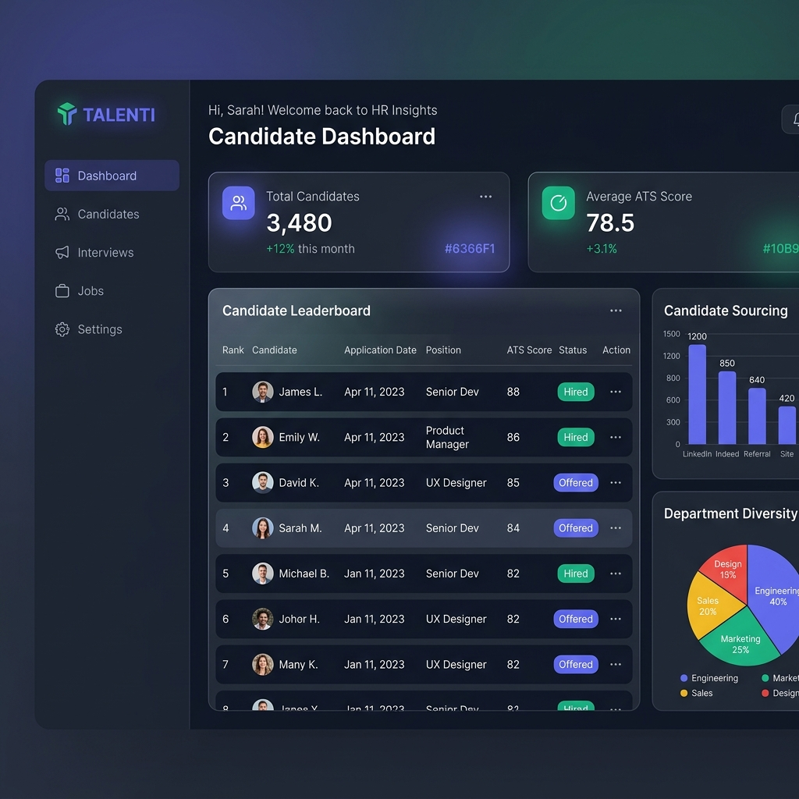
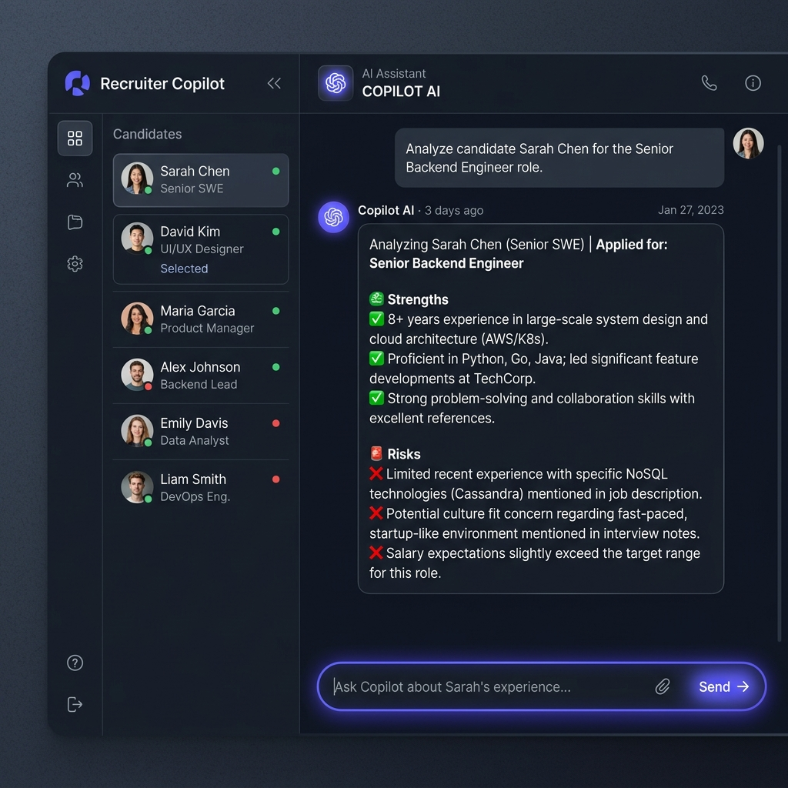
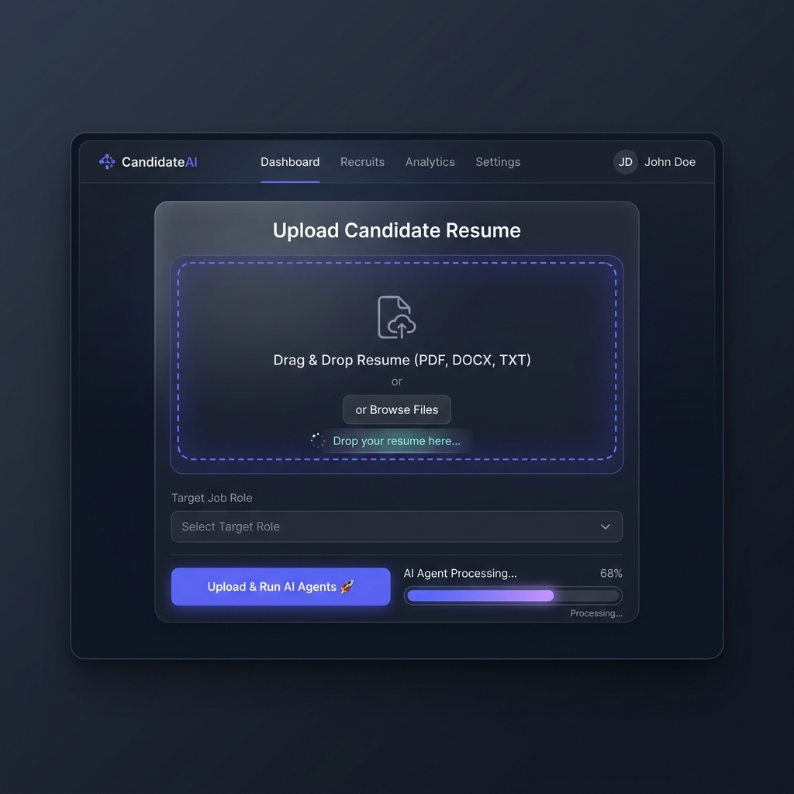

# TalentMind AI — Multi-Agent AI Resume Intelligence Platform

<p align="center">
  
</p>

TalentMind AI is a production-grade, privacy-focused HR-Tech SaaS solution that automates resume screening, ATS scoring, candidate ranking, and recruiter briefings using a multi-agent AI architecture.

The entire application runs **locally** using **Ollama + Llama 3**, and does not require any paid API keys or cloud connections.

---

## 🧠 Multi-Agent Architecture

TalentMind AI is orchestrated by a central **Coordinator Agent** that sequences 8 specialized sub-agents:

1. **Resume Parser Agent (LLM)**: Extracts candidate metadata, education history, work experience details, skills list, projects, and certifications from PDF/DOCX.
2. **Skill Extractor Agent (Rule-based + taxonomy)**: Normalizes skill tokens (e.g. `PowerBI` → `Power BI`), classifies skills as technical vs. soft, and maps them to domains.
3. **ATS Analyser Agent (Rule-based)**: Simulates ATS parsers to evaluate format quality, section completeness, action verbs usage, and quantification density.
4. **Job Match Agent (Rule-based + semantic)**: Scores semantic fit (0–100) against job descriptions, identifying key strengths and missing core skills.
5. **Recruiter Agent (LLM)**: Synthesizes findings to generate candidate strengths, risk warnings, and a concise summary paragraph.
6. **Skill Gap Agent (Rule-based + taxonomy)**: Performs set-difference analysis and maps missing skills to concrete learning paths with courses and platform links.
7. **Hiring Decision Agent (Rule-based + synthesis)**: Formulates final recommendations (Strong Hire / Hire / Consider / Reject) and hiring panel briefings.
8. **Ranking Agent (Heuristic)**: Computes a multi-factor weighted leaderboard (ATS 40% + Skill 25% + Experience 20% + Education 10% + Certifications 5%) to sort pools of candidates.
9. **Dynamic Copilot Chat Agent (LLM)**: A real-time, interactive assistant that allows recruiters to ask dynamic questions about a specific candidate, synthesizing the candidate's parsed data, ATS score, strengths, and risks to provide immediate, context-aware answers.

<p align="center">
  
  &nbsp;
  
</p>

---

## 📂 Project Structure

```
TalentMind-AI/
├── agents/             # Multi-agent implementations & Coordinator
├── backend/            # FastAPI app, JWT auth, config, database models, schemas, and scoring engines
├── database/           # PostgreSQL DB initialization scripts
├── docker/             # Dockerfiles for frontend and backend service
├── docs/               # Architecture and setup documentation
├── frontend/           # Next.js 14 Web Application (TypeScript, Tailwind, Framer Motion, Recharts)
├── docker-compose.yml  # Local multi-service orchestration
└── README.md           # This document
```

---

## 🚀 Quick Start (Docker Compose)

The easiest way to run the entire TalentMind AI platform is using Docker Compose:

1. **Start all services**:
   ```bash
   docker-compose up --build
   ```
   This will spin up:
   - **PostgreSQL** (`localhost:5432`): Database storage for candidates, resumes, jobs, and audits.
   - **Ollama** (`localhost:11434`): Local AI model host.
   - **FastAPI Backend** (`localhost:8000`): REST API, JWT auth, and Coordinator pipeline.
   - **Next.js Frontend** (`localhost:3000`): Sleek recruiter panel.

2. **Pull the Llama 3 model** (required on first run):
   ```bash
   docker exec -it talentmind-ollama ollama pull llama3
   ```

3. **Navigate to the web interface**:
   Open [http://localhost:3000](http://localhost:3000) in your browser.

---

## 🛠️ Local Development Setup (Without Docker)

### Prerequisites
- **Python 3.10+**
- **Node.js 18+**
- **Ollama** installed and running (`ollama run llama3`)
- **PostgreSQL** running locally

### 1. Backend Setup
1. Navigate to the backend directory:
   ```bash
   cd backend
   ```
2. Create and activate a virtual environment:
   ```bash
   python -m venv venv
   source venv/bin/activate  # On Windows: venv\Scripts\activate
   ```
3. Install dependencies:
   ```bash
   pip install -r requirements.txt
   ```
4. Copy the environment template and customize database details:
   ```bash
   cp .env.example .env
   ```
5. Run the FastAPI development server:
   ```bash
   uvicorn main:app --reload --port 8000
   ```

### 2. Frontend Setup
1. Navigate to the frontend directory:
   ```bash
   cd ../frontend
   ```
2. Install npm dependencies:
   ```bash
   npm install
   ```
3. Run the Next.js dev server:
   ```bash
   npm run dev
   ```
4. Open [http://localhost:3000](http://localhost:3000).

---

## 🔑 Demo Sandbox Mode

If you don't have Ollama or PostgreSQL running, TalentMind AI features an intelligent **Demo Sandbox fallback mode**.
- The backend will automatically activate demo fallbacks if it detects that Ollama is unreachable.
- On the frontend Login page, click **Quick Fill Demo Admin Credentials** to bypass authorization and test the premium evaluation interface, dashboards, Recharts analytics, and interview questions.

---

## 🛡️ License
MIT License. Built locally and securely for modern recruiting teams.
