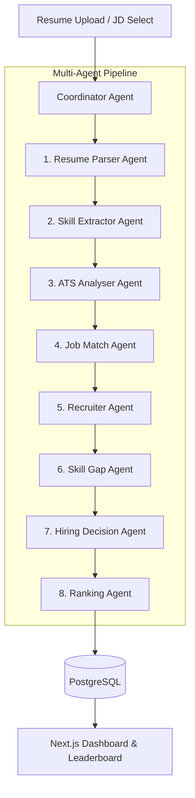

# TalentMind AI — Multi-Agent Architecture

This document describes the design, execution sequence, data schemas, and integration patterns of the TalentMind AI Resume Intelligence multi-agent pipeline.

---

## 🏗️ Architecture Overview

TalentMind AI leverages a sequential multi-agent orchestration architecture managed by a central **Coordinator Agent**. The pipeline is designed with **error-isolation principles**, meaning that if any individual AI agent fails, the pipeline catches the failure, injects sensible fallback values, and continues to ensure a zero-crash production environment.



---

## 🤖 Pipeline Agents Reference

### 1. Resume Parser Agent (LLM)
- **Role**: Structured Profile Extractor.
- **Implementation**: Sends the raw text content to the local `llama3` instance via a structured prompt containing schemas.
- **Fail-safe**: If the LLM output is malformed, the agent falls back to a regex-based token scanner to extract details (Email, Phone, LinkedIn, Skills, Education, Work Experience) to ensure database write integrity.

### 2. Skill Extractor Agent (Heuristic + Taxonomy)
- **Role**: Skill Normalizer & Grouper.
- **Implementation**: Maps messy variations (e.g. `reactjs`, `react.js` → `React`) into canonical skill titles using a predefined lookup map. It classifies them into technical vs. soft skills and groups them by domain (e.g. Backend, Frontend, Cloud/DevOps).

### 3. ATS Analyser Agent (Heuristic)
- **Role**: Section & Formatting Evaluator.
- **Implementation**: Scans the document structure to verify the presence of mandatory sections (Summary, Experience, Education, Skills, Contact). It evaluates readability based on line length, bullet points count, and uses of action verbs vs. passive language.

### 4. Job Match Agent (Semantic)
- **Role**: Candidate-JD Gap Evaluator.
- **Implementation**: Analyzes skill overlaps between the candidate profile and the target role description, scoring direct fit from 0 to 100%.

### 5. Recruiter Agent (LLM)
- **Role**: Briefing Writer.
- **Implementation**: Uses Ollama to compose a professional summary paragraph, a bulleted list of 5 key strengths, and 3 risk factors.

### 6. Skill Gap Agent (Taxonomy)
- **Role**: Upskilling Director.
- **Implementation**: Performs a set-difference evaluation on job requirements and candidate skills, mapping gaps to specific course listings (Udemy, Coursera) with platforms and URLs.

### 7. Hiring Decision Agent (Synthesis)
- **Role**: Recruitment Panel Adviser.
- **Implementation**: Computes a final decision (Strong Hire / Hire / Consider / Reject) along with next-steps checklist (interview guides, reference checking).

### 8. Ranking Agent (Multi-factor Leaderboard)
- **Role**: Talent Pool Ranker.
- **Implementation**: Combines all candidate metrics into a weighted score:
  
  $$\text{Final Score} = 0.40 \times \text{ATS} + 0.25 \times \text{Skill} + 0.20 \times \text{Experience} + 0.10 \times \text{Education} + 0.05 \times \text{Certifications}$$

  Saves the leaderboard order to PostgreSQL.

---

## 📦 Data Schema (Entity Relationships)

```
+------------------+         +------------------+         +------------------+
|      users       |1       *|     resumes      |1       1|    candidates    |
|------------------|---------|------------------|---------|------------------|
| id (PK)          |         | id (PK)          |         | id (PK)          |
| email (Unique)   |         | user_id (FK)     |         | resume_id (FK)   |
| password_hash    |         | filename         |         | name, email      |
| role             |         | raw_text         |         | skills (JSON)    |
| is_active        |         | parsed_json      |         | years_exp        |
+------------------+         +------------------+         +------------------+
         |1                           |1                           |1
         |                            |                            |
         |*                           |*                           |*
+------------------+         +------------------+         +------------------+
| job_descriptions |1       *| analysis_results |*       1|     rankings     |
|------------------|---------|------------------|---------|------------------|
| id (PK)          |         | id (PK)          |         | id (PK)          |
| user_id (FK)     |         | resume_id (FK)   |         | jd_id (FK)       |
| title            |         | jd_id (FK, Opt)  |         | candidate_id (FK)|
| description      |         | ats_score        |         | rank             |
| required_skills  |         | match_score      |         | final_score      |
+------------------+         +------------------+         +------------------+
```

---

## ⚡ Performance Optimization & Security

1. **Local Isolation**: All LLM processing takes place on localhost via Ollama. No candidate resumes or personal data are sent to external cloud APIs.
2. **Database Auditing**: Changes to resumes, jobs, and logins are logged in the `audit_logs` table for security monitoring.
3. **JWT Access Control**: All backend routers require Bearer token validation and apply user scoping to prevent data access leaks.
